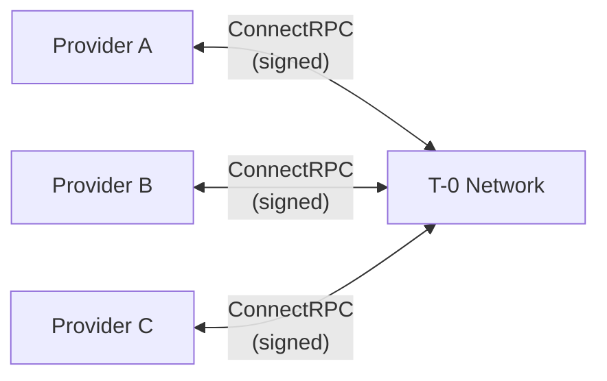
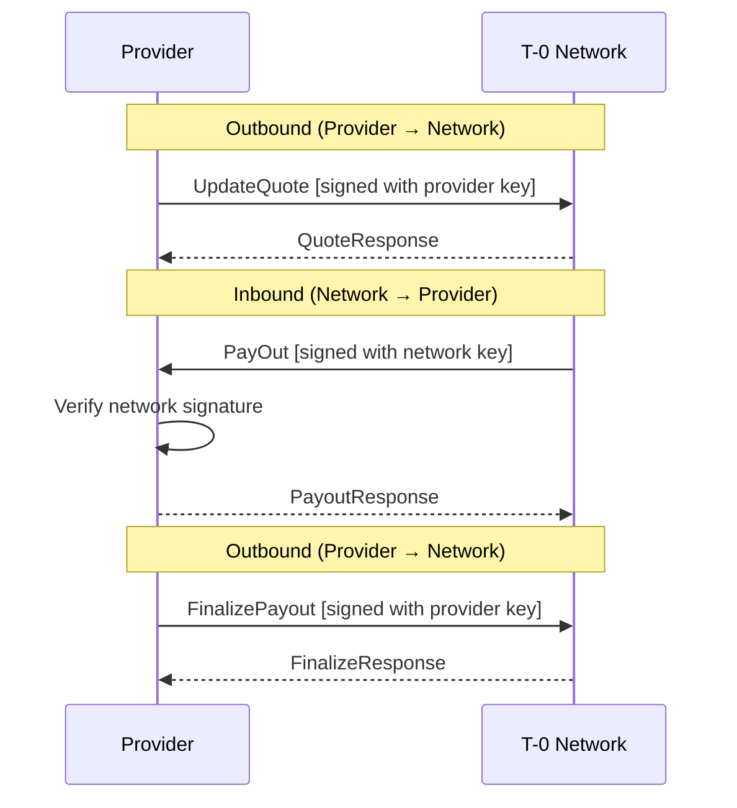
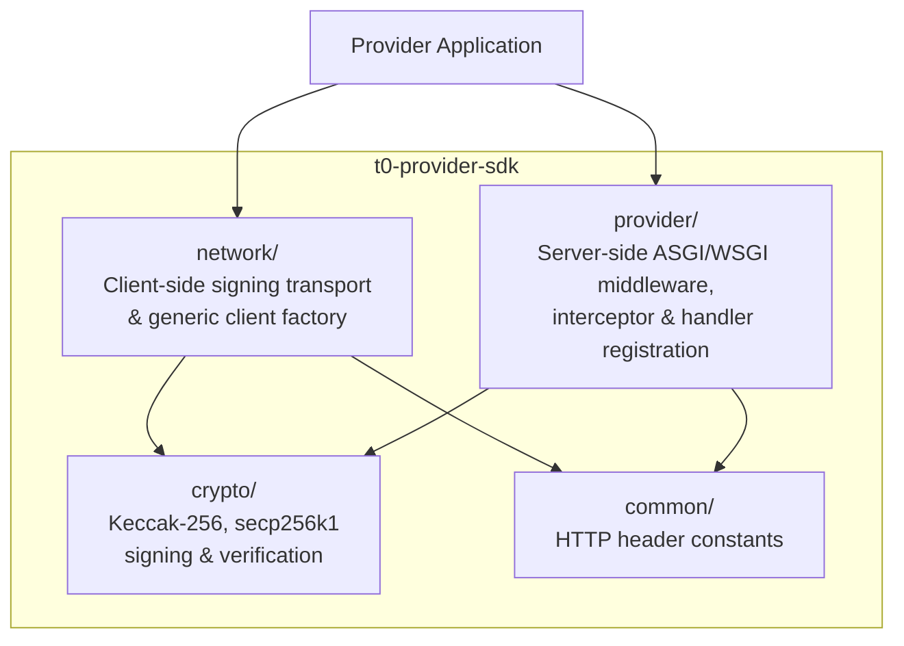
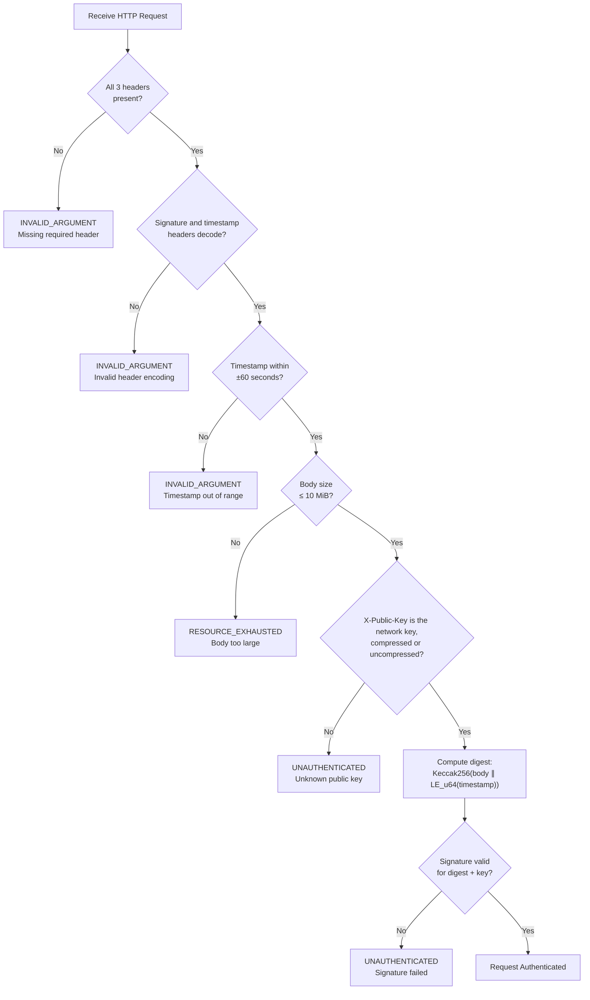
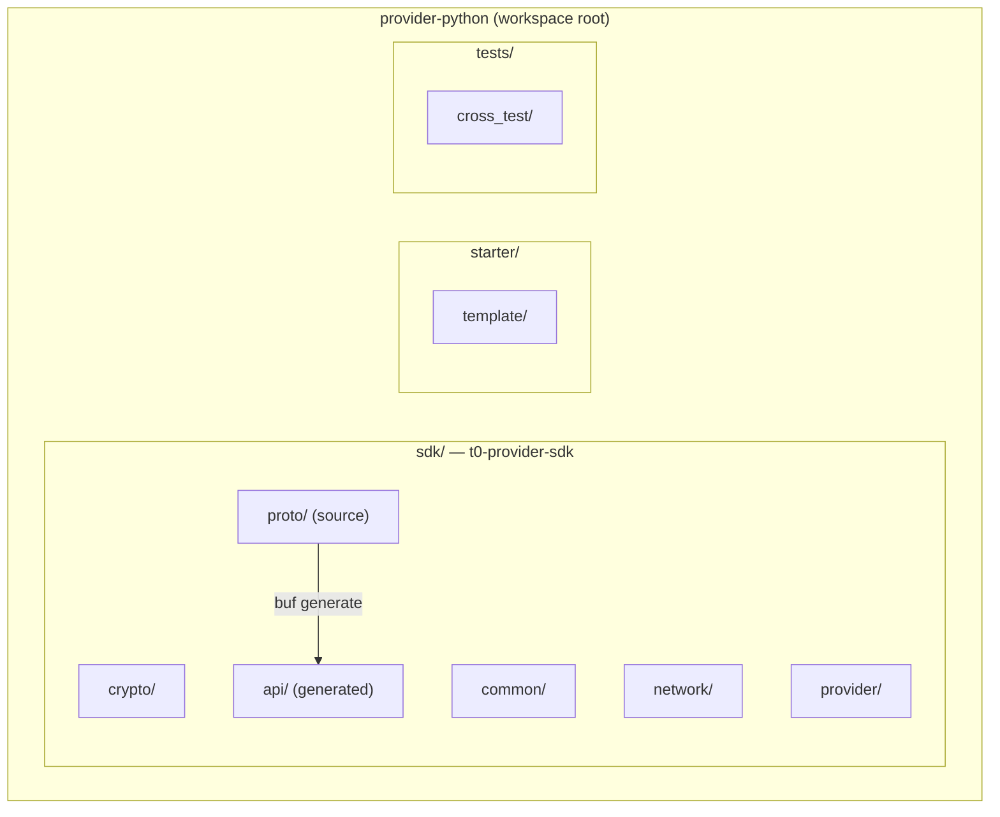
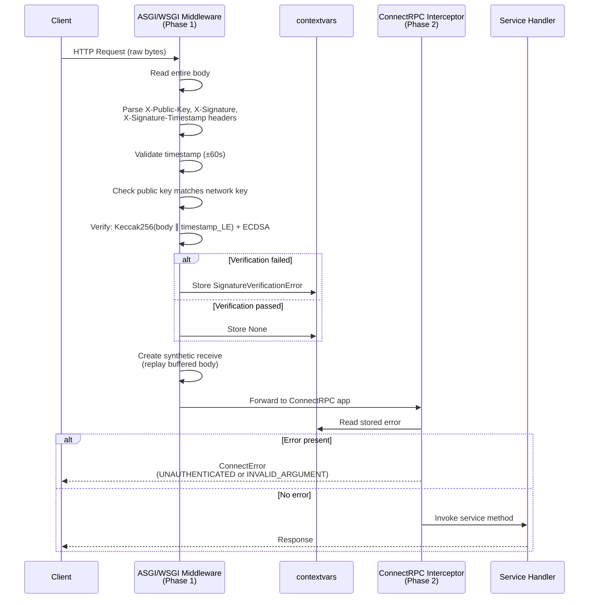
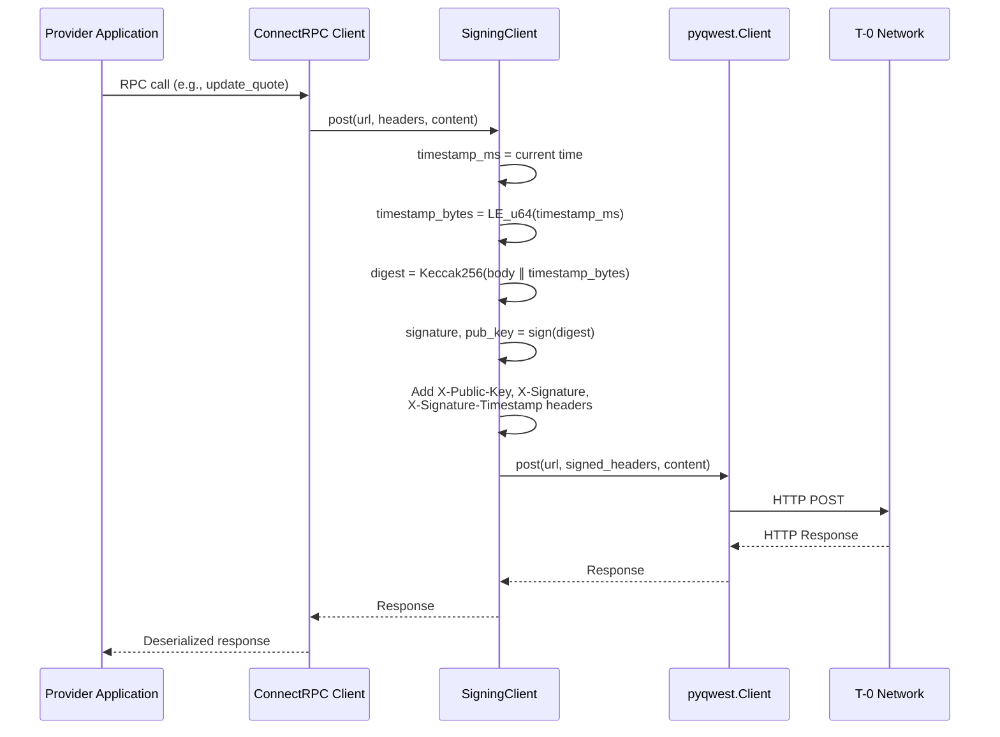
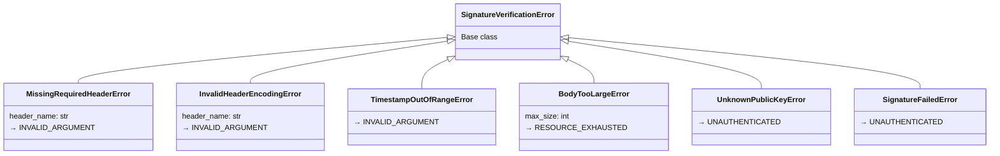
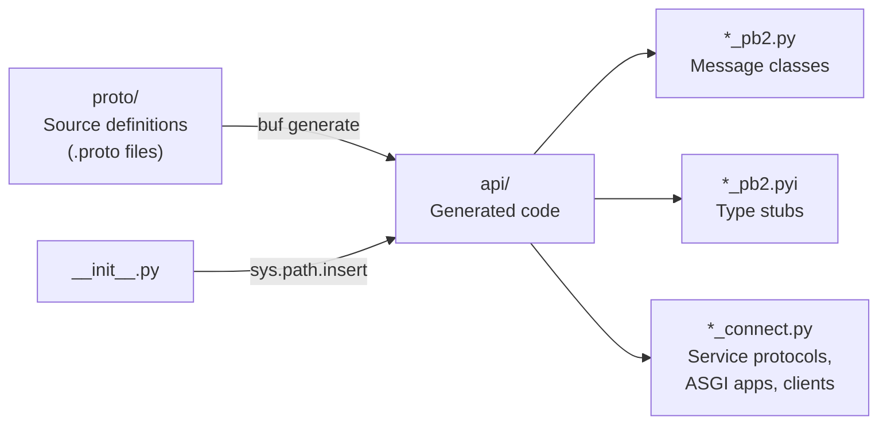

# T-0 Provider Python SDK -- Architecture

---

## Table of Contents

1. [System Overview](#1-system-overview)
   - 1.1 [The T-0 Network](#11-the-t-0-network)
   - 1.2 [Role of the Python Provider SDK](#12-role-of-the-python-provider-sdk)
   - 1.3 [Key Concepts](#13-key-concepts)
   - 1.4 [Communication Model](#14-communication-model)
   - 1.5 [SDK Architecture at a Glance](#15-sdk-architecture-at-a-glance)
2. [Protocol Specification](#2-protocol-specification)
   - 2.1 [Signature Protocol](#21-signature-protocol)
   - 2.2 [Error Classification](#22-error-classification)
   - 2.3 [RPC Service Definitions](#23-rpc-service-definitions)
   - 2.4 [Transport Protocol](#24-transport-protocol)
3. [Architecture and Design Decisions](#3-architecture-and-design-decisions)
   - 3.1 [Technology Stack](#31-technology-stack)
   - 3.2 [Package Architecture](#32-package-architecture)
   - 3.3 [Server-Side: Two-Phase Verification](#33-server-side-two-phase-verification)
   - 3.4 [Client-Side: Signing Transport](#34-client-side-signing-transport)
   - 3.5 [Proto-Agnostic Design](#35-proto-agnostic-design)
   - 3.6 [Error Hierarchy Design](#36-error-hierarchy-design)
   - 3.7 [Go SDK Correspondence](#37-go-sdk-correspondence)
   - 3.8 [Protobuf Code Generation Pipeline](#38-protobuf-code-generation-pipeline)
   - 3.9 [Starter Template](#39-starter-template)
4. [Implementation Reference](#4-implementation-reference)
   - 4.1 [Cryptographic Primitives (`crypto/`)](#41-cryptographic-primitives-crypto)
   - 4.2 [Shared Constants (`common/`)](#42-shared-constants-common)
   - 4.3 [Client-Side Transport (`network/`)](#43-client-side-transport-network)
   - 4.4 [Server-Side Framework (`provider/`)](#44-server-side-framework-provider)
   - 4.5 [Generated Code (`api/`)](#45-generated-code-api)
   - 4.6 [Starter Template](#46-starter-template)
   - 4.7 [Testing Architecture](#47-testing-architecture)
   - 4.8 [Development Guide](#48-development-guide)

---

## 1. System Overview

### 1.1 The T-0 Network

The T-0 Network is a payment settlement system that connects payment providers -- banks, payment service providers (PSPs), and FX brokers -- through cryptographically authenticated remote procedure calls. The network operates on a bilateral trust model where every request between parties is authenticated using secp256k1 ECDSA digital signatures over Keccak-256 message digests.

Each participant in the network holds a secp256k1 keypair. Outgoing requests are signed with the sender's private key, and incoming requests are verified against the expected sender's public key. This ensures message integrity and sender authentication without relying on TLS client certificates or shared secrets.



### 1.2 Role of the Python Provider SDK

The Python Provider SDK (`t0-provider-sdk`) handles all cryptographic, transport, and protocol machinery so that provider developers can focus exclusively on business logic. It provides:

- **Server-side middleware** that verifies incoming request signatures from the T-0 Network
- **Client-side transport** that signs outgoing requests to the T-0 Network
- **Cryptographic utilities** for Keccak-256 hashing and secp256k1 ECDSA signing/verification
- **Generic, proto-agnostic** handler and client factories for ConnectRPC services

The SDK is a faithful port of the Go SDK (the golden standard), ensuring binary-compatible signatures and cross-language interoperability. The unified CLI (`t0-init`) scaffolds complete provider projects from the starter template in `starter/template/`.

### 1.3 Key Concepts

| Term | Definition |
|------|-----------|
| **Provider** | A payment service provider integrated with the T-0 Network |
| **ProviderService** | The server-side RPC service that the T-0 Network calls on the provider (inbound) |
| **NetworkService** | The client-side RPC service that the provider calls on the T-0 Network (outbound) |
| **Signature Protocol** | The Keccak-256 + secp256k1 ECDSA message authentication scheme |
| **ConnectRPC** | The RPC framework used for communication; its clients speak the Connect protocol (HTTP/1.1 or HTTP/2) and gRPC |
| **Raw Payload Bytes** | The original HTTP request body bytes as they appear on the wire |
| **Network Public Key** | The T-0 Network's secp256k1 public key, used to verify inbound requests |
| **Provider Private Key** | The provider's secp256k1 private key, used to sign outbound requests |

### 1.4 Communication Model

Communication between a provider and the T-0 Network is bidirectional. Both sides initiate calls and both sides authenticate requests using the same signature protocol.

**Inbound (Network calls Provider):** The T-0 Network sends signed requests to the provider's `ProviderService`. The provider's SDK middleware verifies the network's signature before the request reaches the service handler.

**Outbound (Provider calls Network):** The provider sends signed requests to the network's `NetworkService`. The SDK's signing transport automatically signs each request with the provider's private key.



### 1.5 SDK Architecture at a Glance

The SDK is organized into four module groups, each with a clear responsibility and minimal coupling:



| Module | Responsibility |
|--------|---------------|
| `crypto/` | Keccak-256 hashing, secp256k1 key management, ECDSA signing and verification |
| `common/` | HTTP header name constants shared between client and server |
| `network/` | Signing HTTP transport wrapper and generic ConnectRPC client factory |
| `provider/` | ASGI/WSGI signature verification middleware, ConnectRPC error interceptor, and generic handler registration |

---

## 2. Protocol Specification

The rules every SDK shares (key, timestamp, window, framing, body limit, error codes) are in [`docs/CROSS_SDK_RULES.md`](../CROSS_SDK_RULES.md); if this chapter and that page differ, that page is right. This chapter walks through the signature protocol without referring to Python code.

### 2.1 Signature Protocol

#### 2.1.1 Message Construction

Every HTTP request body is authenticated by computing a digital signature over the body bytes concatenated with a timestamp. The message is constructed as follows:

```
message = body || timestamp
```

Where:
- **`body`** is the raw HTTP request body (0 to 10,485,760 bytes by default). These MUST be the exact bytes on the wire. Protobuf serialization is not canonical -- deserializing and re-serializing a Protobuf message can produce different bytes. The signing and verification layers must operate on the original wire bytes, never on re-serialized output.
- **`timestamp`** is the current time in milliseconds since the Unix epoch, encoded as a **little-endian unsigned 64-bit integer** (8 bytes).

```
Message byte layout:
┌──────────────────────┬─────────────────────────┐
│ body bytes           │ timestamp (8 bytes)      │
│ (0 .. 10,485,760)    │ little-endian uint64     │
└──────────────────────┴─────────────────────────┘
```

> **CRITICAL INVARIANT:** The body bytes used for signing and verification MUST be the exact bytes from the HTTP request. Re-encoding a deserialized Protobuf message produces different bytes and will cause signature verification to fail.

**Streaming RPCs and gRPC:** a request that goes through `stream()` (Connect streams and every gRPC call) is signed over its **first envelope** only, exactly as sent (flags ‖ uint32be length ‖ payload); a Connect unary request (`post()`) is signed over its whole body. See [docs/STREAMING.md](../STREAMING.md#what-is-signed).

#### 2.1.2 Digest Computation

The message is hashed using **legacy Keccak-256** (the pre-NIST Keccak variant used in the Ethereum ecosystem). The output is always 32 bytes.

| Property | Keccak-256 (used) | SHA-3-256 (NOT used) |
|----------|-------------------|---------------------|
| Padding | Multi-rate (0x01) | Domain-separated (0x06) |
| Hash of empty input | `c5d2460186f7233c...` | `a7ffc6f8bf1ed766...` |
| Ecosystem | Ethereum, secp256k1 | NIST standard |

> **WARNING:** NIST SHA-3-256 and legacy Keccak-256 produce different outputs for the same input due to different padding schemes. They are not interchangeable.

#### 2.1.3 Signature Generation

The 32-byte digest is signed using **secp256k1 recoverable ECDSA**. The signing function receives a pre-hashed digest (no additional hashing is performed internally). The signature format is:

```
signature = r (32 bytes) || s (32 bytes) || v (1 byte)
```

Where `v` is the recovery ID (0 or 1), enabling public key recovery from the signature. The total signature length is **65 bytes**.

The signer also outputs the **uncompressed public key** (65 bytes: `0x04 || x(32) || y(32)`) for inclusion in the request headers.

#### 2.1.4 HTTP Header Encoding

Three HTTP headers carry the authentication data on every request:

| Header | Format | Length | Example |
|--------|--------|--------|---------|
| `X-Public-Key` | `0x` + hex(public_key_65_bytes) | 132 chars | `0x04fa1465c0...` |
| `X-Signature` | `0x` + hex(signature_65_bytes) | 132 chars | `0x304502210...` |
| `X-Signature-Timestamp` | Decimal string of milliseconds | 13+ chars | `1700000000000` |

All hex-encoded values use lowercase hexadecimal characters and include the `0x` prefix.

#### 2.1.5 Verification Procedure

The receiving party verifies an incoming request through the following steps:



Verification uses public key **recovery**: the public key is recovered from the signature and digest, then compared to the expected sender's public key. If the signer receives a 64-byte signature (without the recovery byte), both possible recovery IDs (0 and 1) are tried.

### 2.2 Error Classification

Signature verification errors fall into three categories based on the nature of the failure. The codes are the same in every SDK: [`docs/CROSS_SDK_RULES.md`](../CROSS_SDK_RULES.md).

| Error Condition | ConnectRPC Code | Category |
|----------------|-----------------|----------|
| Missing required header | `INVALID_ARGUMENT` | Malformed request |
| Invalid header encoding | `INVALID_ARGUMENT` | Malformed request |
| Timestamp out of range | `INVALID_ARGUMENT` | Clock drift / replay |
| Body too large | `RESOURCE_EXHAUSTED` | Size constraint |
| `X-Public-Key` present but not the network key (bad hex, not a key, or another key) | `UNAUTHENTICATED` | Authentication failure |
| Signature verification failed | `UNAUTHENTICATED` | Authentication failure |

The distinction determines the appropriate response: `INVALID_ARGUMENT` indicates the request was structurally invalid, `RESOURCE_EXHAUSTED` that its body was over the limit, and `UNAUTHENTICATED` that the request could not be authenticated.

### 2.3 RPC Service Definitions

#### 2.3.1 ProviderService (Inbound)

The T-0 Network calls these RPCs on the provider. All methods are idempotent.

| RPC | Purpose |
|-----|---------|
| `PayOut` | Network instructs the provider to execute a payout to a recipient |
| `UpdatePayment` | Status update on a payment the provider initiated |
| `UpdateLimit` | Notification of changes to the provider's limits |
| `AppendLedgerEntries` | New ledger transactions and entries |
| `ApprovePaymentQuotes` | Last-look quote approval request after AML check |

#### 2.3.2 NetworkService (Outbound)

The provider calls these RPCs on the T-0 Network.

| RPC | Purpose |
|-----|---------|
| `UpdateQuote` | Publish pay-out and pay-in quotes with rate bands |
| `GetQuote` | Request a quote for a specific currency and payment method |
| `FinalizePayout` | Report the outcome of a payout (success with receipt or failure) |
| `CompleteManualAmlCheck` | Report the outcome of a manual AML check for a payout (approved or rejected) |

### 2.4 Transport Protocol

Communication uses **ConnectRPC**, a modern RPC framework that transmits Protobuf messages over standard HTTP/1.1 or HTTP/2. Key characteristics:

- **Content-Type:** `application/proto` (binary Protobuf serialization)
- **HTTP Method:** `POST` for all unary RPCs
- **Request Path:** `/<package>.<Service>/<Method>` (e.g., `/tzero.v1.payment.ProviderService/PayOut`)
- **Compatibility:** Works behind standard HTTP load balancers and reverse proxies without gRPC-specific infrastructure

ConnectRPC was chosen over gRPC for its HTTP/1.1 compatibility, simpler deployment requirements, and native browser support.

---

## 3. Architecture and Design Decisions

### 3.1 Technology Stack

#### Core Dependencies

| Concern | Library | PyPI Name | Import | Rationale |
|---------|---------|-----------|--------|-----------|
| RPC Framework | connectrpc | `connectrpc>=0.11.1` | `connectrpc` | Official ConnectRPC Python runtime (renamed from `connect-python` at v0.10.0). Floor is 0.11.1: the generated stubs use `connectrpc.compat` so the runtime's protobuf-py default codec is bypassed in favour of the shipped `google.protobuf` messages |
| HTTP Client | pyqwest | `pyqwest>=0.11.0` | `pyqwest` | Rust-backed HTTP client of connectrpc; the signing wrappers turn off redirects, and 0.11 aborts an upload whose source fails instead of ending it normally |
| Protobuf | protobuf | `protobuf>=7.34.1` | `google.protobuf` | Standard Protocol Buffers runtime |
| ECDSA Crypto | coincurve | `coincurve>=21.0` | `coincurve` | Python bindings for libsecp256k1 |
| Keccak Hash | pycryptodome | `pycryptodome>=3.23` | `Crypto.Hash.keccak` | Legacy Keccak-256 implementation. Not `pysha3` (incompatible with Python 3.13) and not `hashlib.sha3_256` (NIST SHA-3, different padding) |
| Validation | protovalidate | `protovalidate>=2.0` | `protovalidate` | Checks provider responses against the `buf.validate` rules in the protos. Floor is 2.0: the SDK reads 2.0's error types and field paths |
| Health | grpcio-health-checking | `grpcio-health-checking>=1.60` | `grpc_health.v1` | The `grpc.health.v1` messages of the health service |
| Env Loading | python-dotenv | `python-dotenv>=1.0` | `dotenv` | Template .env file handling (template dependency) |

#### Rejected Alternatives

| Rejected | Reason |
|----------|--------|
| `pysha3` | Incompatible with Python 3.13 |
| `hashlib.sha3_256()` | Implements NIST SHA-3, not legacy Keccak-256 (different padding) |
| Pre-0.10 `connectrpc` on PyPI (v0.0.1 by Gaudiy) | Squatted package, not the official runtime; pin `>=0.10.0` to skip it |
| `connectrpc` 0.10.x with current stubs | Stubs generated with `protobuf=google` import `connectrpc.compat`, absent before 0.11; conversely, pre-0.11 stubs on a 0.11 runtime fail every request with `ConnectError('to_binary')` |

### 3.2 Package Architecture

The repository is a **uv workspace** containing the SDK package, a starter template, and a shared test directory:



| Directory | Purpose |
|-----------|---------|
| `sdk/` | Core library (`t0-provider-sdk` on PyPI) -- crypto, transport, middleware, handler registration |
| `starter/template/` | Starter template scaffolded by the unified CLI (`t0-init init --lang=python`) |

The SDK requires **Python 3.13+** and uses **Hatchling** as the build backend.

### 3.3 Server-Side: Two-Phase Verification

The server-side signature verification uses a **two-phase architecture** to bridge the gap between raw HTTP processing and ConnectRPC's application-level interceptor system.

**Why two phases?** Signature verification MUST operate on raw HTTP body bytes (before Protobuf deserialization), but ConnectRPC's interceptor system only runs after deserialization. A single-layer approach is impossible without modifying ConnectRPC internals.



**Phase 1 -- ASGI/WSGI Middleware:**
- Both variants check the signature headers first (V10 in `docs/CROSS_SDK_RULES.md`: presence and format, the window, the network key, the signature length), then read the body (at most the limit; a declared `Content-Length` over it is refused unread), then verify the signature over the raw bytes, and store any error in a `contextvars.ContextVar`
- **ASGI:** reads the body through the raw `receive` callable and replays it with a synthetic `receive`; for a rejected request it first reads and discards what the caller is still sending (bounded), so the caller reads the answer instead of a reset connection
- **WSGI:** reads the body from `environ["wsgi.input"]` and replaces it with a `BytesIO`
- A rejected request goes on with an empty request message in place of its body (and without its encoding headers), so ConnectRPC decodes nothing the caller sent and reaches the interceptor, which answers with the rejection whatever the body held

**Phase 2 -- ConnectRPC Interceptor:**
- Runs inside ConnectRPC's request pipeline, after Protobuf deserialization
- Reads the error (if any) from `contextvars`
- Raises a properly typed `ConnectError` with the appropriate status code
- If no error is present, proceeds to the service handler

The two phases communicate through `contextvars.ContextVar`, which is request-scoped in both async (each ASGI coroutine) and sync (each WSGI request thread) Python contexts.

### 3.4 Client-Side: Signing Transport

On the client side, the SDK wraps the HTTP client to inject signature headers before each outgoing request. ConnectRPC Python calls exactly three methods on its HTTP client: `get()`, `post()`, and `stream()`. The signing wrapper signs `post()` and `stream()`, adds the headers, and delegates to the real HTTP client; `get()` is refused, since a GET has no body to sign.



**Streaming requests:** ConnectRPC hands `stream()` an iterator of envelopes, one per message. The wrapper signs the first envelope as soon as it is available, sends at once and forwards the rest unbuffered; see [docs/STREAMING.md](../STREAMING.md#when-the-request-is-sent).

**Wrapper pattern (not subclass):** the wrapper holds the real client and delegates to it. ConnectRPC calls only `get()`, `post()` and `stream()`, so the wrapper covers everything it uses and nothing else of `pyqwest.Client` leaks through.

Both async (`SigningClient` wrapping `pyqwest.Client`) and sync (`SigningSyncClient` wrapping `pyqwest.SyncClient`) variants are provided. Their transports do not follow redirects: a redirect would re-send the signed request, headers included, to another URL, so a 3xx response fails the call.

### 3.5 Proto-Agnostic Design

The handler registration and client factory functions are **generic** -- they work with any generated ConnectRPC service without being tied to specific Protobuf definitions.

**Server side:** The `handler()` function accepts any generated `ConnectASGIApplication` class and any object implementing the corresponding service Protocol. Multiple services can be registered and composed into a single ASGI application via `new_asgi_app()`. For synchronous servers, `handler_sync()` accepts `ConnectWSGIApplication` classes and composes them via `new_wsgi_app()`.

**Client side:** The `new_service_client()` function accepts any generated `ConnectClient` class and returns a fully configured instance with signing transport.

In Go, this genericity is achieved via generics (`Handler[T any]`, `NewServiceClient[T]`). In Python, it is achieved using `TypeVar` and duck typing through the generated Protocol classes:

```python
# Works with ANY generated ConnectRPC service -- no SDK changes needed
# Async (ASGI):
app = new_asgi_app(
    network_public_key,
    handler(ProviderServiceASGIApplication, my_provider_impl),
    handler(AnotherServiceASGIApplication, my_other_impl),  # multiple services
)
# Sync (WSGI):
app = new_wsgi_app(
    network_public_key,
    handler_sync(ProviderServiceWSGIApplication, my_sync_impl),
)

client = new_service_client(private_key, NetworkServiceClient, base_url=DEFAULT_BASE_URL)
client_sync = new_service_client_sync(private_key, NetworkServiceClientSync, base_url=DEFAULT_BASE_URL)
```

### 3.6 Error Hierarchy Design

Signature verification errors form a flat hierarchy under a single base class. Each concrete error class represents one specific failure mode and maps to exactly one ConnectRPC status code.



The interceptor uses `isinstance()` checks to determine the ConnectRPC error code:
- `UnknownPublicKeyError`, `SignatureFailedError` → `Code.UNAUTHENTICATED`
- `BodyTooLargeError` → `Code.RESOURCE_EXHAUSTED`
- All others → `Code.INVALID_ARGUMENT`

### 3.7 Go SDK Correspondence

The Python SDK is a faithful port of the Go SDK. Each Go module maps to a Python module with equivalent functionality:

| Go SDK File | Python SDK File | Purpose |
|-------------|-----------------|---------|
| `crypto/hash.go` | `crypto/hash.py` | Keccak-256 hashing |
| `crypto/sign.go` | `crypto/signer.py` | ECDSA signing with SignFn |
| `crypto/verify_signature.go` | `crypto/verifier.py` | Signature verification |
| `crypto/helper.go` | `crypto/keys.py` | Key conversion utilities |
| `common/header.go` | `common/headers.py` | HTTP header constants |
| `network/signing_transport.go` | `network/signing.py` | Signing HTTP wrapper |
| `network/client.go` | `network/client.py` | Generic client factory |
| `provider/verify_signature.go` | `provider/middleware.py` (ASGI), `provider/middleware_wsgi.py` (WSGI) | Signature verification |
| `provider/signature_error.go` | `provider/interceptor.py` | Error-to-ConnectError conversion |
| `provider/handler.go` | `provider/handler.py` | Handler registration |

When porting changes from Go to Python (or vice versa), use this table to locate the corresponding module.

### 3.8 Protobuf Code Generation Pipeline

Proto definitions are the source of truth and live in the repository's root `proto/`. The `buf` tool generates Python code from the root `buf.gen.yaml` into `sdk/src/t0_provider_sdk/api/`. Generated code is committed to the repository to avoid requiring the `buf` toolchain at runtime or install time.



Generated code uses absolute imports like `from tzero.v1.payment import provider_pb2`. To make these imports resolve, the SDK's `__init__.py` adds the `api/` directory to `sys.path` at import time.

**Regeneration:** When proto definitions change, regenerate from the repository root:

```bash
uv sync --project python --all-packages   # the Python connect plugin is a dev dependency
buf generate
```

### 3.9 Starter Template

The starter template in `starter/template/` is scaffolded by the unified CLI (`t0-init init --lang=python`). The template is a buildable standalone project using `my-provider` as the literal project name; the CLI replaces this with the actual project name during scaffolding.

**Scaffolded project structure:**

```
my_provider/
├── pyproject.toml          # Project config (depends on t0-provider-sdk)
├── Dockerfile              # Multi-stage build with uv + uvicorn
├── .env                    # Generated private key + defaults
├── .env.example            # Template for reference
└── src/provider/
    ├── main.py             # Async entry point with uvicorn
    ├── config.py           # Environment variable loading
    ├── publish_quotes.py   # Sample quote publishing loop
    ├── get_quote.py        # Sample quote retrieval
    └── handler/
        └── payment.py      # ProviderService stubs with TODO comments
```

The generated `main.py` demonstrates the complete initialization flow: load config, create network client with signing transport, register service handlers, start ASGI server with signature verification middleware.

---

## 4. Implementation Reference

### 4.1 Cryptographic Primitives (`crypto/`)

#### 4.1.1 `hash.py` -- Keccak-256

Computes the legacy Keccak-256 hash using `pycryptodome`.

```python
def legacy_keccak256(data: bytes) -> bytes:
    """Compute legacy Keccak-256 hash. Returns 32 bytes."""
```

Uses `Crypto.Hash.keccak` with `digest_bits=256`. This is the pre-NIST Keccak variant (Ethereum-era). Do NOT substitute with `hashlib.sha3_256()` -- the different padding produces different output.

**Known test vector:** `Keccak256(b"hello")` = `1c8aff950685c2ed4bc3174f3472287b56d9517b9c948127319a09a7a36deac8`

#### 4.1.2 `keys.py` -- Key Conversion Utilities

All functions use `coincurve.PrivateKey` and `coincurve.PublicKey`. Hex strings support the `0x` prefix.

| Function | Signature | Notes |
|----------|-----------|-------|
| `private_key_from_hex` | `(hex_key: str) -> PrivateKey` | 64 hex digits after an optional `0x`/`0X`, value in [1, n-1]; `ValueError` otherwise |
| `public_key_from_hex` | `(hex_key: str) -> PublicKey` | Deprecated (not used by the SDK). Optional `0x`/`0X`, strict hex, compressed (33B) or uncompressed (65B) |
| `public_key_to_bytes` | `(key: PublicKey) -> bytes` | Returns 65-byte uncompressed: `04 ∥ x(32) ∥ y(32)` |
| `public_key_from_bytes` | `(data: bytes) -> PublicKey` | Deprecated (not used by the SDK). Compressed or uncompressed |

#### 4.1.3 `signer.py` -- ECDSA Signing

Defines the `SignFn` Protocol and provides factory functions for creating signers.

```python
class SignFn(Protocol):
    def __call__(self, digest: bytes) -> tuple[bytes, bytes]:
        """Sign a 32-byte digest. Returns (signature_65B, public_key_65B)."""
        ...
```

| Function | Signature | Notes |
|----------|-----------|-------|
| `new_signer` | `(private_key: PrivateKey) -> SignFn` | Creates a signing closure |
| `new_signer_from_hex` | `(hex_key: str) -> SignFn` | Convenience: hex key → signer |

Key implementation details:
- Uses `coincurve.PrivateKey.sign_recoverable(digest, hasher=None)`
- `hasher=None` means the digest is pre-hashed (no double-hashing)
- Returns `r(32) ∥ s(32) ∥ v(1)` = 65 bytes (Ethereum wire format)
- The public key is computed once in the factory and captured in the closure

#### 4.1.4 `verifier.py` -- Signature Verification

Uses recovery-based verification: recovers the public key from the signature and compares it to the expected key.

```python
def verify_signature(public_key: PublicKey, digest: bytes, signature: bytes) -> bool:
    """Verify ECDSA signature. Accepts 64-byte (r+s) or 65-byte (r+s+v) signatures."""
```

- Uses only r and s: a 65-byte signature is verified as its first 64 bytes, so its recovery byte is ignored (rule V5)
- Tries both recovery ids, `v=0` and `v=1`, and succeeds if either recovers the expected key (this also accepts a high s)
- Uses `PublicKey.from_signature_and_message(sig, digest, hasher=None)`
- Compares recovered key to expected key in uncompressed format (65 bytes)
- Returns `False` for any exception during recovery (invalid signature data)

### 4.2 Shared Constants (`common/`)

#### 4.2.1 `headers.py`

Three constants define the HTTP header names used in the signature protocol:

| Constant | Value |
|----------|-------|
| `SIGNATURE_HEADER` | `"X-Signature"` |
| `SIGNATURE_TIMESTAMP_HEADER` | `"X-Signature-Timestamp"` |
| `PUBLIC_KEY_HEADER` | `"X-Public-Key"` |

### 4.3 Client-Side Transport (`network/`)

#### 4.3.1 `signing.py` -- Signing HTTP Transport

**`SigningClient`** (async) wraps `pyqwest.Client` and adds signature headers to every request.

```python
class SigningClient:
    def __init__(self, sign_fn: SignFn, *, transport: Any | None = None) -> None: ...
    async def get(self, url, headers=None) -> Any: ...  # refused: GET requests are not supported
    async def post(self, url, headers=None, content=None) -> Any: ...
    def stream(self, method, url, headers=None, content=None) -> AbstractAsyncContextManager[Response]: ...
```

**`SigningSyncClient`** is the synchronous equivalent wrapping `pyqwest.SyncClient`. `stream()` takes the envelopes connectrpc passes (one per chunk), a pre-framed body as bytes, or no content (an empty stream), and in each case signs the first envelope as sent.

Both classes share the signing logic via the `_sign_request()` helper, which takes the bytes the signature covers:

1. `timestamp_ms = int(time.time() * 1000)`
2. `timestamp_bytes = struct.pack("<Q", timestamp_ms)` (little-endian uint64)
3. `digest = legacy_keccak256(body + timestamp_bytes)`
4. `signature, pub_key = sign_fn(digest)`
5. Set headers: `X-Public-Key = "0x" + pub_key.hex()`, `X-Signature = "0x" + signature.hex()`, `X-Signature-Timestamp = str(timestamp_ms)`

What `body` is: the whole body of `post()`, or the first envelope of `stream()` exactly as sent; see [docs/STREAMING.md](../STREAMING.md#what-is-signed).

#### 4.3.2 `client.py` -- Generic Client Factory

Creates ConnectRPC clients with signing transport. Proto-agnostic -- works with any generated client class.

```python
def new_service_client(
    private_key: str,           # Hex-encoded secp256k1 private key
    client_class: type[T],      # Generated ConnectRPC client class
    *,
    base_url: str | None = None,                    # omitted or None is "base URL is not set"
    timeout: float = DEFAULT_TIMEOUT,               # Unary calls, seconds
    stream_timeout: float = DEFAULT_STREAM_TIMEOUT,  # Client-/server-streaming calls, seconds
    wire_format: WireFormat = WireFormat.BINARY,    # or WireFormat.JSON
    protocol: Protocol = Protocol.CONNECT,          # or Protocol.GRPC
    sign_fn: SignFn | None = None,                  # signs in place of private_key
) -> T: ...

def new_service_client_sync(
    private_key: str,
    client_class: type[T],
    *,
    base_url: str | None = None,                    # omitted or None is "base URL is not set"
    timeout: float = DEFAULT_TIMEOUT,
    stream_timeout: float = DEFAULT_STREAM_TIMEOUT,
    wire_format: WireFormat = WireFormat.BINARY,
    protocol: Protocol = Protocol.CONNECT,
    sign_fn: SignFn | None = None,
) -> T: ...
```

The functions check the base URL (rule C2 in [`docs/CROSS_SDK_RULES.md`](../CROSS_SDK_RULES.md)) and the key, create a `SignFn` from the private key (unless `sign_fn` is given), wrap it in `SigningClient`/`SigningSyncClient`, and pass it as the `http_client` parameter to the generated ConnectRPC client constructor, together with the protocol, the codec for `WireFormat.JSON` and `send_compression=None` (requests go out uncompressed). `Protocol.GRPC` on an `http://` base URL gets an HTTP/2 transport without TLS.

`timeout` (15 s) is the default of unary calls and `stream_timeout` (300 s) that of client- and server-streaming calls; a per-call `timeout_ms` replaces it, shorter or longer. A `timeout` or `stream_timeout` that is not greater than zero raises `ValueError`; a per-call `timeout_ms` goes to connectrpc as is. Bidirectional calls raise `ConnectError(Code.UNIMPLEMENTED)` before anything is sent. See [docs/STREAMING.md](../STREAMING.md#stream-timeout).

#### 4.3.3 `options.py`

| Constant | Value | Purpose |
|----------|-------|---------|
| `DEFAULT_BASE_URL` | `"https://api.t-0.network"` | T-0 Network API endpoint |
| `DEFAULT_TIMEOUT` | `15.0` | Unary call timeout in seconds |
| `DEFAULT_STREAM_TIMEOUT` | `300.0` | Client- and server-streaming call timeout in seconds |
| `WireFormat` | `BINARY`, `JSON` | Enum for the factories' `wire_format` option |
| `Protocol` | `CONNECT`, `GRPC` | Enum for the factories' `protocol` option |

### 4.4 Server-Side Framework (`provider/`)

#### 4.4.1 `errors.py` -- Error Hierarchy

All errors extend `SignatureVerificationError`. See [Section 3.6](#36-error-hierarchy-design) for the class diagram.

| Error Class | Attributes | Message Format |
|-------------|-----------|----------------|
| `MissingRequiredHeaderError` | `header_name: str` | `"missing required header: {name}"` |
| `InvalidHeaderEncodingError` | `header_name: str` | `"invalid header encoding: {name}"` |
| `InvalidTimestampError` | `reason: str` | `"invalid timestamp header: {reason}"` (`not a decimal number`, `value out of range`) |
| `TimestampOutOfRangeError` | -- | `"timestamp is outside the allowed time window"` |
| `BodyTooLargeError` | `max_size: int` | `"max payload size of {max_size} bytes exceeded"` |
| `UnknownPublicKeyError` | -- | `"request signed with unknown public key"` |
| `SignatureFailedError` | -- | `"signature verification failed"` |

#### 4.4.2 `middleware.py` / `middleware_wsgi.py` -- Signature Verification

The most complex modules in the SDK. Implement Phase 1 of the [two-phase verification](#33-server-side-two-phase-verification). `middleware.py` handles ASGI, `middleware_wsgi.py` handles WSGI. Both share `_check_headers()` and `_verify_body()` (the core verification logic is protocol-agnostic).

**Key exports:**

| Name | Type | Purpose |
|------|------|---------|
| `signature_error_var` | `ContextVar[SignatureVerificationError \| NOT_VERIFIED \| None]` | Communication channel to interceptor. Defaults to `NOT_VERIFIED`, so a call the middleware did not verify is refused |
| `VerifySignatureFn` | `dataclass` | Callable that verifies signature against network public key |
| `signature_verification_middleware` | `function` | ASGI middleware factory |
| `signature_verification_middleware_wsgi` | `function` | WSGI middleware factory (in `middleware_wsgi.py`) |

**Constants:**

| Constant | Value |
|----------|-------|
| `DEFAULT_MAX_BODY_SIZE` | `10 * 1024 * 1024` (10 MiB) |
| `TIMESTAMP_WINDOW_MS` | `60_000` (60 seconds; fixed) |

**`VerifySignatureFn`** is a frozen dataclass holding the network's public key. When called, it:
1. Parses the signer's public key (33-byte compressed or 65-byte uncompressed) and compares it to the network public key as a point (raises `UnknownPublicKeyError` for bytes that are not a key, or for another key)
2. Validates signature length (64-65 bytes, else `SignatureFailedError`), in the same order as the server (rule V10; both use `_check_signer`)
3. Computes `Keccak256(message)` and verifies the signature (raises `SignatureFailedError` on failure)

**`signature_verification_middleware(app, verify_fn, max_body_size)`** returns an ASGI middleware that:
1. Checks the headers with `_check_headers()`
2. Reads the body with `_BodyReader.read()` (enforcing the size limit)
3. Verifies the signature with `_verify_body()`
4. Stores the result (an error, or `None`) in `signature_error_var`; for an error, replaces the body with `_rejection_body()`. If the caller is still sending, the answer goes out at once and only the message that ends the response waits while the rest of the body is read (`_AnswerThenDrain`), at most 4× the body limit and 1 s, so an HTTP/1.1 client reads the answer instead of a reset under its upload. HTTP/2 without trailers ends at once, without a drain
5. Forwards to the downstream ASGI app with a replayed `receive`, and resets `signature_error_var` when it returns

`verify_fn` is the `VerifySignatureFn` built by `new_verify_signature`, or, as in 1.2.1, a `CustomVerifyFn` of the caller's own, called after the header checks and before the body is decoded; such a function decides the signature itself. `new_asgi_app` and `new_wsgi_app` always use the network key.

**`signature_verification_middleware_wsgi(app, verify_fn, max_body_size)`** (in `middleware_wsgi.py`) does the same for WSGI, reading the body from `environ["wsgi.input"]` with `_read_wsgi_body()` and replaying it with a `BytesIO`.

**Internal helpers:**

| Function | Purpose |
|----------|---------|
| `_check_headers(network_public_key, headers)` | Everything the headers decide, in the shared order; returns the signature and the timestamp bytes |
| `_verify_body(network_public_key, headers, body, signed)` | Verifies over the whole body; failing that, for an `application/grpc*` body of exactly one uncompressed frame, over the message without its 5-byte prefix |
| `_parse_scope_headers(scope)` | Extracts headers from ASGI scope as a dict |
| `_parse_timestamp(headers)` | Parses the timestamp header (ASCII digits, below 2^63), returns `(ms_int, LE_8bytes)` |
| `_BodyReader` | Reads the ASGI body with size enforcement, and drains a rejected one after its answer |
| `_AnswerThenDrain` | Wraps `send` for a rejected call: sends the answer at once, then reads the rest of the body (bounded by bytes and time) before ending the response |
| `_rejection_body(headers)` | The empty request message replayed in place of a rejected body |
| `_replay_receive(body)` | Returns a synthetic ASGI `receive` callable |

#### 4.4.3 `interceptor.py` -- ConnectRPC Error Conversion

Implements Phase 2 of the two-phase verification. Provides both async and sync interceptors.

```python
class SignatureErrorInterceptor:
    """Async interceptor. Implements UnaryInterceptor Protocol."""
    async def intercept_unary(self, call_next, request, ctx) -> Any: ...

class SignatureErrorInterceptorSync:
    """Sync interceptor."""
    def intercept_unary_sync(self, call_next, request, ctx) -> Any: ...
```

Both interceptors call `_raise_if_signature_error()` which reads from `signature_error_var` and raises `ConnectError` with the appropriate code, or `INTERNAL` ("no signature result in context") when the value is still `NOT_VERIFIED`.

> **ConnectRPC Python specifics:** `Interceptor` is a **Union type**, not a base class. Async interceptors implement the `UnaryInterceptor` Protocol with `intercept_unary(self, call_next, request, ctx)`. Sync interceptors implement `UnaryInterceptorSync` with `intercept_unary_sync(self, call_next, request, ctx)`.

#### 4.4.4 `handler.py` -- Handler Registration and ASGI/WSGI Composition

Provides the top-level API for registering service handlers and creating composite ASGI or WSGI applications.

**Key types:**

```python
BuildHandler = Callable[[_HandlerOptions], tuple[str, ASGIApp]]
BuildHandlerSync = Callable[[_HandlerOptions], tuple[str, WSGIApp]]
HandlerOption = Callable[[_HandlerOptions], None]
```

**`handler(asgi_app_factory, service_impl, *options) -> BuildHandler`**

Registers an async service handler. The `asgi_app_factory` is a generated ConnectRPC ASGI application class (e.g., `ProviderServiceASGIApplication`). The `service_impl` is the user's implementation of the service Protocol. Returns a `BuildHandler` callable that produces a `(path, app)` tuple when invoked.

**`handler_sync(wsgi_app_factory, service_impl, *options) -> BuildHandlerSync`**

Registers a sync service handler. Parallel to `handler()` but accepts WSGI application classes (e.g., `ProviderServiceWSGIApplication`) and sync service implementations.

**`new_asgi_app(network_public_key, *build_handlers) -> ASGIApp`**

Creates the composite ASGI application:
1. Creates `_HandlerOptions` with the `SignatureErrorInterceptor`
2. Builds all registered handlers, collecting `(path, app)` pairs
3. Creates an ASGI path-prefix router via `_create_router()`
4. Wraps the router with `signature_verification_middleware`

**`new_wsgi_app(network_public_key, *build_handlers) -> WSGIApp`**

Creates the composite WSGI application (parallel to `new_asgi_app()`):
1. Creates `_HandlerOptions` with the `SignatureErrorInterceptorSync`
2. Builds all registered handlers, collecting `(path, app)` pairs
3. Creates a WSGI path-prefix router via `_create_wsgi_router()`
4. Wraps the router with `signature_verification_middleware_wsgi`

Both routers use simple path-prefix matching. ConnectRPC request paths follow the pattern `/<package>.<Service>/<Method>`, so prefix matching on the service path correctly routes all methods of a service.

`network_public_key` is required, and surrounding whitespace is stripped. It may be compressed (33 bytes) or uncompressed (65 bytes), with an optional `0x`/`0X` prefix (the rule shared by every SDK: root `CLAUDE.md`). Both functions check it before building anything: an empty or whitespace-only key raises `NetworkPublicKeyRequiredError` (a `ValueError`), and a malformed key raises `ValueError("invalid network public key: ...")`.

`handler()` and `handler_sync()` build each service app with the signature interceptor first, after the `HandlerOption`s have run, so no option can remove it.

### 4.5 Generated Code (`api/`)

The `api/` directory contains buf/protobuf-generated Python code. It is committed to the repository and should not be manually edited.

**Directory structure:**

```
api/
├── buf/validate/           # buf.validate stubs (generated, used by protovalidate)
├── ivms101/v1/ivms/        # Travel rule data structures
└── tzero/v1/
    ├── common/             # Shared types (Decimal, enums)
    ├── payment/            # ProviderService + NetworkService
    └── payment_intent/     # Payment intent services
```

**Generated file types:**

| Suffix | Content |
|--------|---------|
| `*_pb2.py` | Protobuf message classes (deserialization, serialization) |
| `*_pb2.pyi` | Type stubs for IDE autocompletion and static analysis |
| `*_connect.py` | ConnectRPC service Protocols, ASGI/WSGI applications, and client classes |

**Key generated types (from `payment/provider_connect.py`):**

| Type | Purpose |
|------|---------|
| `ProviderService` | Protocol class -- defines the interface providers must implement |
| `ProviderServiceASGIApplication` | ASGI app for serving ProviderService (pass to `handler()`) |
| `ProviderServiceClient` | Async ConnectRPC client for calling ProviderService |
| `ProviderServiceClientSync` | Sync ConnectRPC client for calling ProviderService |

**Import resolution:** The SDK's `__init__.py` adds the `api/` directory to `sys.path` so that generated imports like `from tzero.v1.payment import provider_pb2` resolve correctly. Application code imports generated types using these absolute paths, not through `t0_provider_sdk.api`.

### 4.6 Starter Template

The starter template in `starter/template/` is a complete, runnable application. Key files:

- **`main.py`** -- Async entry point. Initializes the network client, creates the ASGI app with signature verification, starts background quote publishing, and runs the uvicorn ASGI server. Includes commented-out WSGI alternative showing how to switch to `new_wsgi_app()` with gunicorn.
- **`config.py`** -- Loads configuration from `.env`: `PROVIDER_PRIVATE_KEY`, `NETWORK_PUBLIC_KEY`, `TZERO_ENDPOINT`, `PORT`.
- **`handler/payment.py`** -- `ProviderServiceImplementation` (async) class with stub implementations for all 5 RPCs. Each method has TODO comments indicating what to implement.
- **`handler/payment_sync.py`** -- `ProviderServiceSyncImplementation` (sync) class, parallel to `payment.py` but with regular `def` methods for use with WSGI servers.
- **`publish_quotes.py`** -- Publishes sample pay-out and pay-in quotes every 5 seconds via `network_client.update_quote()`. Demonstrates quote bands with rates and amounts.
- **`get_quote.py`** -- Requests a sample quote from the network. Demonstrates the `GetQuoteRequest` API.
- **`Dockerfile`** -- Multi-stage build using `python:3.13-slim` with `uv` for fast dependency installation.
- **`.env.example`** -- Template with default values including the sandbox network public key.

### 4.7 Testing Architecture

- **Unit tests** (`sdk/tests/`) follow the SDK's module layout and need no Go helper. The shared vectors in `cross_test/test_vectors.json` drive the crypto code and both signing wrappers.
- **Integration tests** (`sdk/tests/integration/`) sign through the client transport and verify through the ASGI and WSGI middleware in one process.
- **Cross-language tests** (`tests/cross_test/`) run against the shared Go helper (`cross_test/go_helper/`): signing and verifying in both directions, server-to-server calls in both directions, and streaming calls to the helper's `test.v1.StreamTest`, whose replies name the framing it verified and whose errors give the reason for a refusal. In CI they fail, not skip, when the helper binary is missing.

```bash
# Install all dependencies
uv sync --all-packages

# Run all tests (SDK + integration + cross-tests)
uv run pytest -v

# Run SDK unit tests only
uv run pytest sdk/tests -v

# Run cross-language tests (requires Go helper binary)
cd ../cross_test/go_helper && go build -o go_helper . && cd ../../python
uv run pytest tests/cross_test -v

# Lint
uv run ruff check .
```

### 4.8 Development Guide

#### 4.8.1 Regenerating Proto Code

When `.proto` files change:

From the repository root:

```bash
uv sync --project python --all-packages   # the Python connect plugin is a dev dependency
buf generate
```

Commit the regenerated `api/` directory (the `generate-clients.yaml` workflow does the same).

#### 4.8.2 Adding a New Service

1. Add the `.proto` file to the repository's root `proto/`
2. Run `buf generate` to create the generated code
3. **Server side (ASGI):** Implement the generated service Protocol, then register with `handler()`:
   ```python
   app = new_asgi_app(
       network_public_key,
       handler(NewServiceASGIApplication, my_implementation),
   )
   ```
   **Server side (WSGI):** Use `handler_sync()` and `new_wsgi_app()` with the WSGI application class:
   ```python
   app = new_wsgi_app(
       network_public_key,
       handler_sync(NewServiceWSGIApplication, my_sync_implementation),
   )
   ```
4. **Client side:** Create a signed client using the generated client class:
   ```python
   client = new_service_client(private_key, NewServiceClient, base_url=DEFAULT_BASE_URL)
   client = new_service_client_sync(private_key, NewServiceClientSync, base_url=DEFAULT_BASE_URL)
   ```

No SDK changes are required -- the generic handler and client factories work with any generated service.

#### 4.8.3 Build, Lint, and Test

```bash
uv sync --all-packages       # Install all dependencies
uv run ruff check .           # Lint (rules: E, F, W, I, N, UP, B, A, SIM, TCH)
uv run pytest -v              # Run all tests
uv run pytest sdk/tests -v    # SDK tests only
```

#### 4.8.4 Publishing

The SDK package is built and published via CI:

```bash
uv build --package t0-provider-sdk
```
